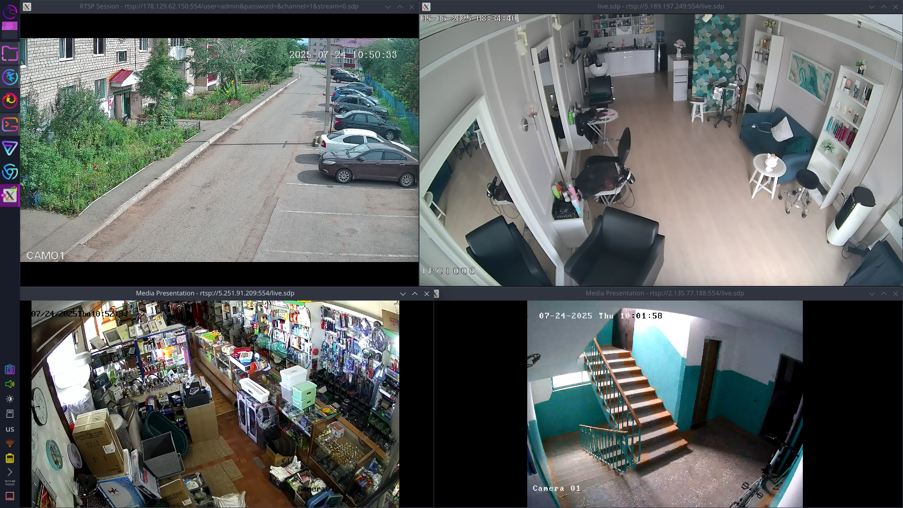
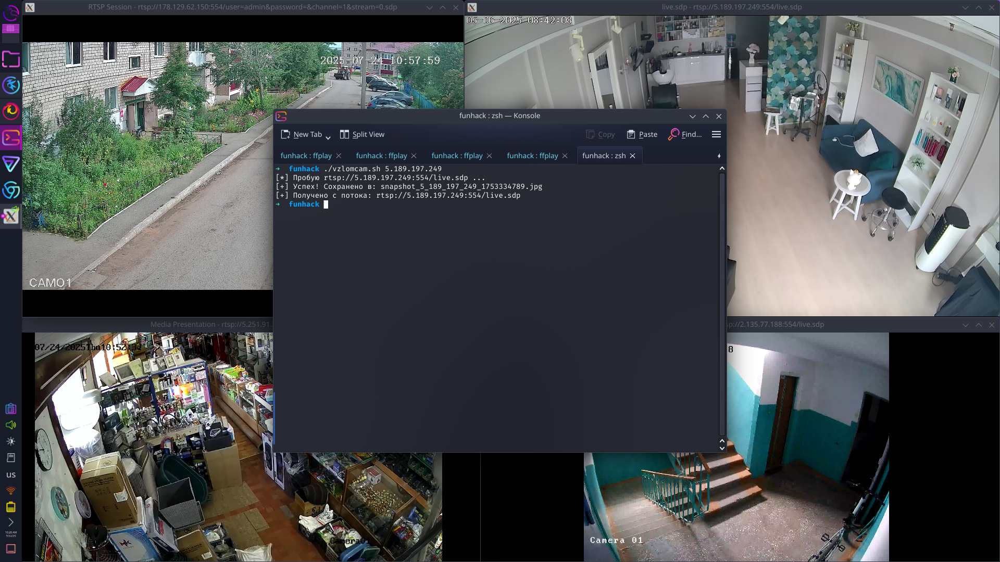

# 📷 Взлом камеры

## 🔍 Что это

Скрипт `vzlomcam.sh` показывает скриншот с уязвимой камеры, найденной через Shodan. Всё просто: вводишь IP — получаешь кадр.
и покажет rtsp url который можно использовать что бы следить через камеру 

---

## 🖼️ Скриншот с камеры

Вот пример изображения, полученного со взломанной камеры:



---

## 💻 Пример запуска скрипта

Вот как выглядит использование скрипта в терминале:



---

## ⚙️ Как найти камеры

1. Заходим на [Shodan.io](https://www.shodan.io)
2. Используем фильтр:port:554 has_screenshot:true
3. Копируем IP-адрес из результатов

---

## 🚀 Как использовать скрипт

1. Сделай скрипт исполняемым:

```bash
chmod +x vzlomcam.sh

